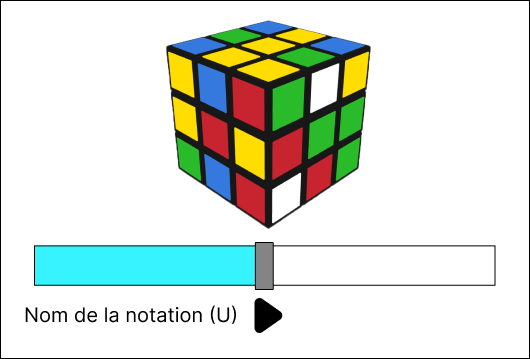

# Abtract V2 [Rubik'Solver] 

## Sujet
Un outil qui affiche les étapes permettant de résoudre un Rubik's cube avec le moins de coup possible [(méthode Fridrich)](http://www.ws.binghamton.edu/fridrich/system.html). Cela se fera en posant un rubik's cube sous deux caméras qui récupèrent les données à traiter.

## Résumer
Le logiciel permet de reconnaitre un rubik's cube grace à deux webcame, d'analyser les informations reçurent des caméras afin de le résoudre avec une méthode choisie.
Pour ce qui est de la reconnaissance il s'agirait d'avoir deux caméras qui filmeraient en temps réel le rubik's cube.

 

#### **Pourquoi deux caméra ?**
J'utilise deux caméras, car, pour résoudre un rubik's cube il faut au moins avoir l'information sur 4 faces. 
Voir 4 faces avec une caméra est un peut compliquer si la caméra ou le cube ne bouge pas. C'est pourquoi j'utilise deux caméras.

Il est également possible de générer un rubik's cube mélanger de façon "optimale" (20 mouvements. Et d'avoir la solution de ce dernier.

## Interface
#### **L'interface complète**

Sur cette page on peut observer deux interfaces :

 - La première zone (à gauche), est la zone ou un rubik's cube 3D apparaîtra. Dans cette zone on peut retrouve une diapositive barre avec deux petits boutons. Ces derniers serviront à naviguer à travers les différentes étapes pour résoudre le rubik's cube. 
 - La deuxième zone (à droite), est la zone ou les termes correspondant au mouvement apparaitrons. Il est possible d'appuyer sur les différents termes apparu pour aller à l'étape correspondante.

 

 

#### **L'interface avec la partie 3D en plein écran**

#### **L'interface avec la partie texte en plein écran**

L'insérer de cette partie serait double :

 - La première utilisation visera des personnes expérimenter dans les cubes et qui comprend cette notation.
 - La deuxième est de pouvoir cliquer sur une lettre est de pouvoir directement aller àa l'étape concerner.

## Navigation

Dans cette application il y aura 6 options de navigation.

 - FILE     : Bouton sera lié à toutes les options lier à l'application.
 - EDIT     : Bouton similaire au précédent avec d'autre options.
 - METHOD   : Bouton permettant de choisir sa méthode de résolution du cube.
 - NOTATION : Bouton fera apparaître les différentes notations avec un exemple.
 - TIMER    : Bouton permettant d'avoir un timer et d'avoir son score personnel.
 - HELP     : Page d'aide.

 

## Existant
- Giiker Super Cube (Rubik's cube physique plus application téléphone)
- [Grubiks (site)](https://www.grubiks.com/puzzles/rubiks-cube-3x3x3/)
- [CubeExplorer](http://kociemba.org/cube.htm)

## Technologie
 - C#
 - OpenCV (emuCV) 
 - OpenGL (Tao, openTK)
 - OpenAL (sound Effect)
 - WebCame / caméra
 - visual studio 2022
 - Figma

### Lien utile
- [Solution d'après madame Fridrich](http://www.ws.binghamton.edu/fridrich/system.html)
- [Site de Jessica Fridrich](http://www.ws.binghamton.edu/fridrich/)
- [Inspiration](https://www.grubiks.com/puzzles/rubiks-cube-3x3x3/)
- [Projet interressant](https://github.com/lucassklp/RubikCube)
- [Vidéo du projet ^^^](https://www.youtube.com/watch?v=1KgFS9PAVEE)
- [Explication sur le rubik's cube](https://www.cube20.org/)
- [Logiciel de création de cube via la webcam (cube Explorer)](http://kociemba.org/cube.htm)
- [Notation des termes du rubik's cube](https://www.francocube.com/notation)

<!-- Markdeep: /// -->

<!--- 

 -->