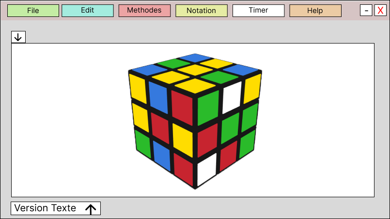

# Abtract V2 [Rubik'Solver] 

## Sujet
Un outils permetant de résoudre un Rubik's cube avec le moins de coup possible [(méthode Fridrich)](http://www.ws.binghamton.edu/fridrich/system.html). Cela ce fera en posant un rubik's cube sous deux caméras qui récupéront les données à traiter.

## Abstrac
Le logiciel permet de reconnaitre un rubik's cube grace à deux webcame, d'analyser les informations reçu des caméra afin de le résoudre avec une méthodes choisit.
Pour ce qui est de la reconnaisance il s'agirait d'avoir deux caméras qui filmerais en temp réel le rubik's cube.

#### **Pourquoi deux caméra ?**
J'utilise deux caméra, car, pour résoudre un rubik's cube il faut au moin avoir l'information sur 4 face. 
Voir 4 face avec une caméra est un peux compliquer si la caméra ou le cube ne bouge pas. C'est pourquoi j'utilise deux caméra.

Il est égalemnt possible de générer un rubik's cube mélanger de façon "optimale" (20 mouvement). Et d'avoir la solution de ce dernier.

## Interface
#### **L'interface complète**

Sur cette page on peux observer deux interface :  
 - La première zone (à gauche), est la zone ou un rubik's cube 3D apparaitra. Dans cette zone on peut retrouve une diapositive barre avec deux petits boutons. Ces derniers serviront à naviguer à travers les différentes étapes pour résoudre le rubik's cube.  
 - La deuxième zone (à droite), est la zone ou les termes correspondant au mouvement apparaitrons. Il est possible d'appuyer sur les différents termes apparu pour aller à l'étape correspondante.
#### **L'interface avec la partie 3D en plein écran**

#### **L'interface avec la partie texte en plein écran**

L'intérer de cette partie serais double : 
 - La première utilisation visera des personnes expérimenter dans les cubes et qui comprend cette notation.

## Navigation

## Existant
- Giiker Super Cube (Rubik's cube physique plus application téléphone)
- [Grubiks (site)](https://www.grubiks.com/puzzles/rubiks-cube-3x3x3/)
- [CubeExplorer]((http://kociemba.org/cube.htm))

## Technologie
 - C#
 - OpenCV (emuCV) 
 - OpenGL (Tao, openTK)
 - OpenAL (sound Effect)
 - WebCame / caméra
 - visual studio 2022
 - Figma

### Lien utile
- [Solution d'après madame Fridrich](http://www.ws.binghamton.edu/fridrich/system.html)
- [Site de Jessica Fridrich](http://www.ws.binghamton.edu/fridrich/)
- [Inspiration](https://www.grubiks.com/puzzles/rubiks-cube-3x3x3/)
- [Projet interressant](https://github.com/lucassklp/RubikCube)
- [Vidéo du projet ^^^](https://www.youtube.com/watch?v=1KgFS9PAVEE)
- [Explication sur le rubik's cube](https://www.cube20.org/)
- [Logiciel de création de cube via la webcam (cube Explorer)](http://kociemba.org/cube.htm)
- [Notation des termes du rubik's cube](https://www.francocube.com/notation)

