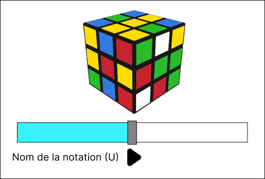
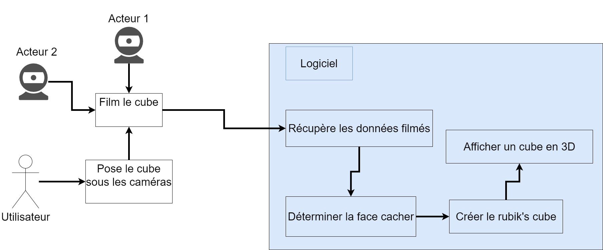

# Abtract V3 [Rubik'Solver] 

## Sujet
Un outil permettant de reconnaître un rubik's cube à l’aide de webcam. Et par la suite d’en créer une version 3D qui permettra de résoudre le rubik's cube.

## Résumé
Le logiciel permet de reconnaître un rubik's cube grâce à deux webcams, d’analyser les informations reçurent des caméras afin de créent un cube en 3D.
Pour ce qui est de la reconnaissance, il s’agirait d’avoir deux caméras qui filmeraient en temps réel le rubik's cube.

 

#### **Pourquoi deux caméras ?**
J’utilise deux caméras pour résoudre un rubik's cube, car il faut au moins avoir l’information sur 5 faces. 
Voir 5 faces avec une caméra est un peu compliqué si la caméra ou le cube ne bouge pas. C’est pourquoi j’utilise deux caméras.

Les caméras seront positionnées de chaque côté du rubik's cube. Ce qui permettra à chaque caméra de voir 3 faces. La face du haut sera la même pour les deux il faudra donc faire attention à ne pas avoir de l’information en double. Une fois que les deux caméras ont reconnu les 5 faces visibles, il sera possible de déterminer la face du bas en fonction des cubes visibles adjacents à cette dernière.

## Interface
#### **L’interface complète**

Sur cette page on peut observer deux interfaces ;

 - La première zone (à gauche), est la zone où un rubik's cube 3D apparaîtra. 
 - La deuxième zone (à droite) est la zone où les termes correspondant au mouvement apparaîtront. 

#### **L’interface avec la partie 3D en plein écran**

#### **L’interface avec la partie texte en plein écran**

 - la première utilisation visera des personnes expérimentées dans les cubes et qui comprennent cette notation.
 - La deuxième est de pouvoir cliquer sur une lettre et de pouvoir directement aller ça l’étape concerner.

## Navigation

Dans cette application,il y aura 6 options de navigation.

 - FILE     : Bouton sera lié à toutes les options lier à l’application.
 - ÉDIT     : Bouton identique au précédent avec d’autres options.
 - METHOD   : Bouton permettant de choisir sa méthode de résolution du cube.
 - NOTATION : Bouton fera apparaître les différentes notations avec un exemple. (Lien vers un site externe)
 - TIMER    : Bouton permettant d’avoir un chronomètre et d’avoir son score personnel.
 - HELP     : Page d’aide et d’information.

 

## Idée supplémentaire  

 - Il est également possible de générer un rubik's cube mélangé de façon "optimale" (20 mouvements. Et d’avoir la solution de ce dernier.

 - Une barre permettant de naviguer dans la résolution du rubik's cube. Ainsi que d’un bouton permettant de passer à la prochaine étape ou de revenir en arrière. 
 
 - L’onglet notation sera par défaut un lien vers un [site externe]( https://www.francocube.com/notation) donnant la signification de chaque nation utiliser pour résoudre un rubik's cube. Dans une seconde dans l’idée serais de faire une petite animation du mouvement avec la lettre associée.

- L’onglet Method possédera une liste comprenant les différentes méthodes de résolution. [(ex.: méthode Fridrich)](http://www.ws.binghamton.edu/fridrich/system.html). Une fois choisit le cube 3D se mettra à tourner pour montrer les différentes étapes de résolution. Également les lettres correspondant à la résolution apparaîtront.
  
- Une idée serait de pouvoir enregistrer dans un fichier les données d’un cube. Grâce à cela on pourrait exporter et importer des rubik's cubes en passant par un format de fichier spécifique (ex: .RC). Dans ce fichier seraient contenues les données permettant de reconstruire un rubis cube.

- Il est possible d’appuyer sur les différents termes apparus pour aller à l’étape correspondante. (Dans la zone de droite).

- Choisir ses flux vidéos
  

## Use case diagramme

## Cas d'utilisation
- L'utilisateur met le rubik's cube sous les caméras.
    * L'application affiche le cube en 3D à l'écran après analyse des données
- L'utilisateur retire le rubik's cube de sous les caméras.
    * L'application n'affichera rien ou un message d'explication.   
- L'utilisateur clique sur le bouton help (aide) 
    *  Une page avec un manuel d'explication de l'utilisation
- L'utilisateur ferme l'application.
    * L'application affiche un message demandant si l'utilisateur veut bien se fermer.
        - Si "oui" : l'application se ferme.
        - Si "non / annuler " : l'application rester ouverte et la fenêtre demandant la confirmation se ferme.   

## Difficulté du projet
Les difficultés de ce projet sont multiples. Il y le faites d’apprend à utiliser emguCv (opencv) afin d’utiliser des caméras et d’analyser les données filmées. Une autre difficulté c’est le fait d’apprendre opengl pour réaliser un cube en 3d. Ces deux activités (la reconnaissant d’objet et les 3D) sont des choses que je n’ai jamais faites en c#.

## Compétence à avoir

Pour réaliser ce projet, je dois pouvoir avoir des compétences techniques qu'actuellement je n'ai pas et qui sont les suivantes :

- [ ] Récupérer le flux vidéo de deux caméras avec un logiciel 
    - [ ] Compétence : emguCV
- [ ] analyser le flux et de déterminer les différentes faces
    - [ ] Mettre en place un algorithme permettant de trouver la face cachée (face du bas) 
- [ ] Créer un cube 3D (OpenGl)

Pour l'instant la seule compétence que je possède c'est de récupérer le flux d'une caméra.
Il me faut donc encore apprendre à analyser le flux et à créer le cube (stocker les données). 
Finalement il me faut encore apprendre à faire un cube en 3D.

## Motivation
Ce projet me motive tout particulièrement pour plusieurs raisons, premièrement j’apprécie de manière générale cet objet qu’est le rubik's cube. Pour le simple, faites que je l'utilise au quotidien. Deuxièmement, je vais utiliser le c# pour faire se travaille. Je suis content de pouvoir utilise ce langage, car dans le cadre de l’école c’est celui avec lequel j’estime avoir le plus d’affinités.

Si je suis motivé pas se projet c'est aussi, car je dois apprendre de nouvelles technologies, étant une personne curieuse cela me motive a découvert ses nouvelles options.

## Existant
- Giiker Super Cube (Rubik’s cube physique plus application téléphone)
- [Grubiks (site)](https://www.grubiks.com/puzzles/rubiks-cube-3x3x3/)
- [CubeExplorer](http://kociemba.org/cube.htm)

## Technologie
 - C#
 - OpenCV (emguCV) 
 - OpenGL (Tao, openTK)
 - WebCame / caméra
 - visuel studio 2022

### Lien utile
- [Solution d’après madame Fridrich](http://www.ws.binghamton.edu/fridrich/system.html)
- [Site de Jessica Fridrich](http://www.ws.binghamton.edu/fridrich/)
- [Inspiration](https://www.grubiks.com/puzzles/rubiks-cube-3x3x3/)
- [Projet intéressant](https://github.com/lucassklp/RubikCube)
- [Vidéo du projet ^^^](https://www.youtube.com/watch?v=1KgFS9PAVEE)
- [Explication sur le rubik's cube](https://www.cube20.org/)
- [Logiciel de création de cubes via la webcam (cube Explorer)](http://kociemba.org/cube.htm)
- [Notation des termes du rubik's cube](https://www.francocube.com/notation)

 <!---Markdeep: -->
<!--- 

 -->